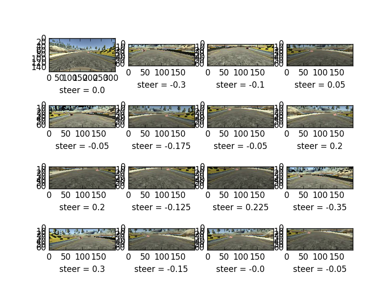

## Introduction ##

For this project I decided to maintain two Python scripts: model.py with all of the CNN model functionality, and custom_functions.py, which contains many functions utilized in the model.py.  This makes model.py much simpler to read and navigate.

I used the data provided by Udacity to train my model.  I initially tried to generate my own data, with both the stable and beta versions of the simulator, but I could not control the car smoothly in either case, without the benefit of a steering wheel or joystick.

## Pre-Processing ##

For my image pre-processing, I leaned heavily on the separate blogposts by Vivek Yadav and Mojtaba Valipour (my Udacity mentor).  Without these resources I fear I would have floundered for many days before I was able to train my model for any semblance of control.

My utility function, pre_process(), uses two possible operating modes: ‘train’ or None.  This allows me to use the same pre-processing for both the training and validation generator, as well as in the driving script, drive.py.  For the latter, I set the mode = None.  In this case, the only function is to crop the image to 66x200 pixels, around the center pixel, and normalize the data.  For training, and for validation, there are several other steps, as follows:
1. The image is randomly translated vertically
2. The image is randomly translated horizontally
3. The image brightness is randomly skewed (in HSV colorspace)
4. The image is randomly flipped horizontally (50% probability).
In the case of horizontal translation, a gain is applied to the magnitude of the translation, and this added to the input steering angle.  As the image is translated further and further, the steering angle adjustment is greater.  In the case of horizontal flipping, the steering angle is also flipped (multiple by -1).

The main way that my implementation is unique from those blogposts above, is that following the translations, during the cropping step, I remove the black space from the final image, by not including it in the cropped area.  As far as I see, both of the blogposts above leave this black space in the image as, essentially, noise.  A sample of my augmentation for a single image is shown here:

## CNN Model Architecture ##

My model architecture is based on that of Nvidia in their end-to-end paper.  The differences are as follows: I did the normalization outside of the CNN, and rather than using multiple pixel strides during convolution, I used max pooling layers after the convolution.  It’s not clear if authors used dropout, but as many references (blogposts above, Confluence posts, etc) cautioned about overfitting in this project, I included dropout after every layer.

For the last layer I chose ‘tanh’ for my activation layer, to ensure I could get results between -1 and +1.  For all other layers I chose ‘relu’.

## Training ##

My original attempts at training the model, were unsuccessful, as the car seemed to drive almost perfectly straight all the time.  I suspect this is due the majority of the data having zero steering angle, and the model tending to overfit to this situation.  My first mitigation strategy for this was to shift most images with zero steering angle to the left or right, and give a nonzero command.  This is implemented via the custom functions horizontal_shift() and pre_process().  After training this model a couple of times with decreasing learning rate, I was able to get a model that cleared the first five or so turns on the track.  At the second sharp turn before a dirt patch, the car drove straight off the road again.  My next mitigation technique was to train again, but to drop 90% of the images where the steering angle is less than 0.1.

For training, I divided the Udacity dataset into both training and validation sets, with an 80/20 split.  I didn’t explicitly make a test dataset, as the real test is whether the car is able to drive around the track in the simulator.  Testing the model on an image dataset in the Keras environment seems a pointless exercise.

## Reflections ##

While it seems possible to train a car to drive in this way, it obviously has some very severe limitations that need to be considered.  For instance, obstacle avoidance is probably much better handled by an active object detection system, and emergency control, then by vision based driving.  Another example is understanding road conditions: wet, icy, sandy, etc.  Obviously the vehicle handling is dependent on the surface over which it is driving, so understanding this variable is critical.  In other words, even if this method can account for 99.9% of situations, that is not nearly good enough.
